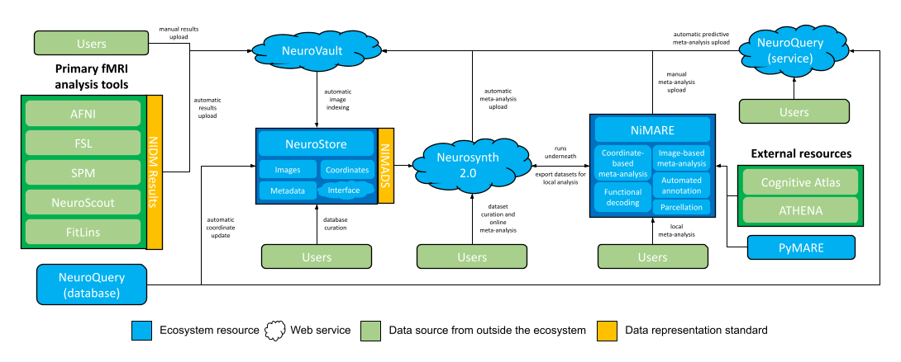

# A New Meta-Analytic Ecosystem for fMRI Research

This site outlines a new ecosystem for fMRI meta-analysis that is currently under construction.

!!! warning
    This page outlines a *tentative* plan for a system of services for neuroimaging meta-analysis.
    Several of the services detailed here do not currently exist or only partially support the functionality described below.
    This plan is likely to change over time.

## NiMARE

[NiMARE][] is a Python package for performing meta-analyses, and derivative analyses using meta-analytic data,
of the neuroimaging literature.
While meta-analytic packages exist which implement one or two algorithms each,
NiMARE provides a standard syntax for performing a wide range of analyses and for interacting with databases of coordinates and images
from fMRI studies (e.g., brainspell, Neurosynth, and NeuroVault).

NiMARE joins a growing Python ecosystem for neuroimaging research, which includes such tools as [Nipype][], [Nistats][], and [Nilearn][].
As with these other tools, NiMARE is open source, collaboratively developed, and built with ease of use in mind.

NiMARE aims to fill a gap in a burgeoning meta-analytic ecosystem.
The goal of NiMARE is to collect a wide range of meta-analytic tools in one Python library.
Currently, those methods are spread out across a range of programming languages and user interfaces,
or are never even translated from the original papers into useable tools.
NiMARE operates on NIMADS-format datasets, which users will be able to compile by searching the NeuroStore database with the pyNIMADS library.
A number of other services in the ecosystem will then use NiMARE functions to perform meta-analyses, including Neurosynth 2.0 and [NeuroVault][].

## Neurosynth 2.0

[Neurosynth 1.0][] currently stores a coordinated-based database of over 14,000 neuroimaging papers (automatically curated by [ACE][]),
provides a web interface for automated meta-analyses, functional decoding, and gene expression visualization,
and provides a Python package implementing the above methods.

As part of an ongoing reorganization of the meta-analytic ecosystem, Neurosynth is being decomposed into multiple services.
The following list describes what has happened to the different components of Neurosynth 1.0:

- The [Neurosynth Python package][] has already been deprecated in favor of NiMARE.
- The database of coordinates and metadata will be incorporated and managed by the new NeuroStore database (see below).
- The web interface for online-meta-analyses will be implemented as Neurosynth 2.0.
  Instead of rendering pre-generated meta-analyses, this new version will allow users to curate datasets from NeuroStore and
  specify meta-analytic models to apply.
  The models themselves will be run on NIMADS-format datasets exported from NeuroStore and using NiMARE algorithms.

Neurosynth 2.0's dataset curation functionality will replace [metaCurious][] within the ecosystem.

## NeuroStore

[NeuroStore][] will act as a centralized repository for coordinates and maps from neuroimaging studies, stored in NIMADS format.

In addition to the database, NeuroStore will provide an API for programmatic querying, as well as a web service with which users
can contribute to the database.

This repository will version control study information so that users may curate the database,
correcting any mistakes in study data or metadata (such as incorrectly-extracted coordinates).
This database curation functionality will fulfill a similar role within the ecosystem to [brainspell][].

NeuroStore will automatically index statistical maps from NeuroVault and ingest newly-extracted coordinates from databases like NeuroQuery.

## NeuroQuery

[NeuroQuery][] is a web service, Python library, and coordinate database built for large-scale, predictive meta-analysis.
Predictive meta-analysis generates non-statistical brain maps from text, using a database of coordinates and associated texts.

Because the [NeuroQuery database][] is more advanced and accurate than the existing Neurosynth 1.0 database,
this new database will effectively replace the old one within the meta-analytic ecosystem.
NiMARE can ingest the NeuroQuery database and convert it automatically to a NiMARE Dataset object for analysis.
Additionally, the NeuroQuery database will feed directly into NeuroStore as a source of coordinates.

NeuroQuery-generated predictive meta-analyses will be exportable directly to NeuroVault.

## NIMADS

[NIMADS][] is a new standard for organizing and representing meta-analytic neuroimaging data.
NIMADS will be used by NeuroStore, pyNIMADS, and NiMARE.

## NeuroVault

[NeuroVault][] is a database for unthresholded images.
Users may upload individual maps or [NIDM Results][] packs, which can be exported from a number of fMRI analysis tools,
like [AFNI][], [SPM][], [FSL][], and [NeuroScout][].

NeuroVault also has integrations with [NeuroPower][] (for power analyses) and [Neurosynth 1.0][] (for functional decoding),
and supports simple image-based meta-analyses using NiMARE.

Additionally, as the ecosystem is built, users will be able to export meta-analysis results from Neurosynth 2.0 or NiMARE,
as well as predictive meta-analyses from NeuroQuery, directly to NeuroVault.

## PyMARE

[PyMARE][] is a Python library for effect-size meta-analysis.
NiMARE uses PyMARE for its image-based meta-analysis algorithms
(with some light wrapping to convert image objects to arrays compatible with PyMARE functions).

<!-- links -->
[ACE]: https://github.com/neurosynth/ACE
[AFNI]: https://afni.nimh.nih.gov
[BrainMap]: http://www.brainmap.org
[BrainSpell]: http://brainspell.org/
[Cognitive Atlas]: http://www.cognitiveatlas.org/
[Cognitive Paradigm Ontology]: http://www.cogpo.org/
[FSL]: https://fsl.fmrib.ox.ac.uk
[NeuroPower]: http://neuropowertools.org
[NeuroQuery]: https://neuroquery.org
[NeuroQuery database]: https://github.com/neuroquery/neuroquery_data
[NeuroScout]: https://alpha.neuroscout.org
[NeuroStars]: https://neurostars.org/latest
[NeuroStore]: https://github.com/neurostuff/neurostore
[NeuroSynth 1.0]: http://neurosynth.org/
[NeuroSynth 2.0]: https://github.com/neurostuff/neurosynth-frontend
[Neurosynth Python package]: https://github.com/neurosynth/neurosynth
[NeuroVault]: https://neurovault.org/
[NIDM Results]: http://nidm.nidash.org/specs/nidm-results_130.html
[Nilearn]: https://nilearn.github.io/
[NIMADS]: https://github.com/neurostuff/NIMADS
[NiMARE]: https://nimare.readthedocs.io/en/latest/
[Nipype]: https://nipype.readthedocs.io/en/latest/index.html
[Nistats]: https://nistats.github.io/
[OpenNeuro]: https://openneuro.org
[peaks2maps]: https://doi.org/10.7490/f1000research.1116395.1
[PyMARE]: https://pymare.readthedocs.io/en/latest/
[scikit-learn]: https://scikit-learn.org/stable/developers/index.html
[Sleuth]: http://www.brainmap.org/software.html#Sleuth
[SPM]: https://www.fil.ion.ucl.ac.uk/spm/
